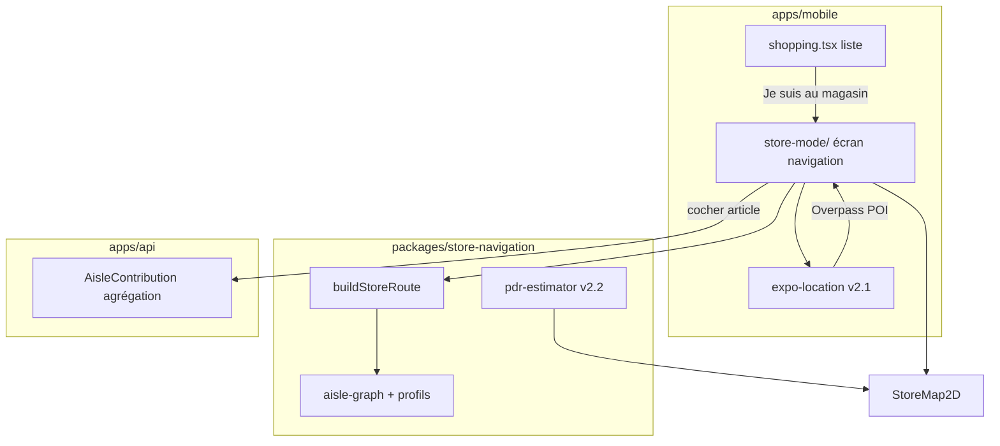

# Plan d'implémentation technique — GPS magasin

> Complète `docs/V2-VISION.md`, `docs/V2-RESEARCH-TECH.md` et **ADR-006** (`docs/adr/006-navigation-magasin-hybride.md`).  
> Objectif : un chemin **exécutable** du POC v2.0 au crowdsourcing v2.3.

---

## 1. Vue d'ensemble



**Principe** : la route est une **séquence d'étapes rayon** optimisée, **visualisée sur un plan 2D schématique** (allées + couloirs), avec le point utilisateur à l'entrée puis en mouvement (PDR). Les contributions Waze enregistrent **où** chaque produit a été pris pour affiner le plan magasin au fil du temps.

### 1.1 Client-first — BDD minimale (décision Steve)

Le GPS magasin vit **surtout dans l'app** :

| Donnée | Où | BDD ? |
|--------|-----|-------|
| Liste courses + cocher | API existante `ShoppingItem` | ✅ Déjà là — inchangé |
| Ordre des rayons / route | `buildStoreRoute()` | ❌ Calcul client |
| Session PDR (pas, distance, cap) | `usePdrSession` en mémoire | ❌ Volatile |
| Magasin choisi + profil layout | AsyncStorage / préférences locales | ❌ v2.0–v2.2 |
| POI magasins proches | Overpass **depuis le mobile** ou cache mémoire session | ❌ v2.1 sans migration |
| Contributions Waze | API agrégation | ✅ **Seule** migration BDD notable — **inclus v2** |

**Hypothèse usage** : le téléphone est **en main** pendant le mode magasin (liste + prochain rayon visibles) → accéléromètre / gyro / podomètre **plus fiables** qu'en poche ou écran éteint.

**Ce qu'on ne persiste pas côté serveur** : trips, pas, distance, position estimée. La synchro groupe reste la liste courses (`purchase` / `unpurchase`) déjà en place.

---

## 2. Nouveau package `packages/store-navigation`

Brique TypeScript pure (comme `shopping-aisles`), consommable par mobile et API.

```
packages/store-navigation/
├── package.json          # @homeshared/store-navigation
├── src/
│   ├── index.ts
│   ├── types.ts
│   ├── aisle-graph.ts    # nœuds = StoreAisleId, arêtes = coût (1 = adjacent)
│   ├── layout-profiles.ts # HYPERMARKET_FR, SUPERMARKET_FR, PROXI_FR
│   ├── layouts/            # coordonnées schématiques allées (grille U, linéaire…)
│   │   ├── hypermarket-fr.ts
│   │   ├── supermarket-fr.ts
│   │   └── proxi-fr.ts
│   ├── build-store-route.ts   # TSP + polyline XY pour le plan 2D
│   ├── route-progress.ts
│   ├── merge-osm-indoor.ts    # fusion layout template + OSM si dispo
│   └── pdr/                # map-matching point sur graphe
│       ├── step-detector.ts
│       └── distance-estimator.ts
└── tests/
    ├── build-store-route.test.ts
    └── layout-profiles.test.ts
```

### 2.1 Graphe de rayons

Chaque profil magasin définit :

- **Rayons actifs** (ex. proxi sans `FISH` dédié → fusion `MEAT`).
- **Ordre de référence** (hérite de `STORE_AISLES.sortOrder`, réordonnable).
- **Matrice d'adjacence** : coût pour passer du rayon A au rayon B (1 = côte à côte, 2 = saut d'une allée).

Exemple simplifié hyper FR (grille en U) :

| De → Vers | PRODUCE | BAKERY | MEAT | … |
|-----------|---------|--------|------|---|
| PRODUCE   | 0       | 1      | 2    | … |
| BAKERY    | 1       | 0      | 1    | … |

Le graphe est **statique par profil** en v2.0–v2.1 ; en v2.3 un magasin peut surcharger via contributions (« ici le riz est en DRY_GROCERY pas SAUCES »).

### 2.2 Algorithme `buildStoreRoute`

Entrée :

```typescript
interface BuildRouteInput {
  items: Array<{ id: string; aisle: StoreAisleId; purchased: boolean }>;
  profile: StoreLayoutProfileId;
  /** Optionnel v2.3 : overrides communautaires par fingerprint produit */
  aisleOverrides?: Map<string, StoreAisleId>;
}
```

Sortie :

```typescript
interface StoreRoute {
  steps: Array<{
    aisle: StoreAisleId;
    items: Array<{ id: string; name: string; /* … */ }>;
  }>;
  skippedAisles: StoreAisleId[]; // rayons vides
  estimatedSteps: number;       // nombre de rayons à visiter
}
```

**Algorithme** (v2.0) :

1. Filtrer items non achetés ; regrouper par `aisle` (appliquer overrides).
2. Liste des rayons distincts `R`.
3. **TSP heuristique** sur le graphe du profil : nearest-neighbor depuis `R[0]` selon `sortOrder` du profil, ou depuis l'entrée magasin fixée (`PRODUCE` par défaut hyper).
4. Trier les items dans chaque rayon par nom (stable).

Complexité O(n²) sur ≤ 9 rayons — négligeable.

Référence open source : [shoptimize](https://github.com/reshinto/shoptimize) (Dijkstra sur layout) — nous restons sur graphe rayon tant qu'on n'a pas de coordonnées allées.

### 2.3 Progression `route-progress.ts`

```typescript
function computeProgress(route: StoreRoute, purchasedIds: Set<string>): {
  percent: number;
  currentStepIndex: number;
  remainingItems: number;
  remainingAisles: number;
}
```

Utilisé par la barre de progression plein écran.

---

## 3. Mobile — structure `apps/mobile/src/features/store-mode/`

```
features/store-mode/
├── StoreModeScreen.tsx       # route expo-router : groups/[groupId]/shopping/store-mode
├── AisleStepView.tsx         # un rayon : liste items + gros CTA cocher
├── StoreModeHeader.tsx       # progression + rayon courant + emoji
├── StoreModeFooter.tsx       # Précédent / Suivant rayon (si items restants ailleurs)
├── hooks/
│   ├── useStoreRoute.ts      # items + buildStoreRoute + cache TanStack
│   ├── useOptimisticPurchase.ts  # extrait de shopping.tsx
│   ├── useStoreSession.ts       # magasin + layout (local)
│   ├── usePdrSession.ts         # expo-sensors + recalage manuel
│   └── useContributionDraft.ts  # brouillon session → batch à la validation
└── components/
    ├── StoreMap2D.tsx           # plan + long-press « Je suis ici »
    ├── CommunityProductPin.tsx  # pin communautaire + signalement
    ├── ProductReportSheet.tsx   # rupture stock / mauvais emplacement
    ├── ValidateContributionsBar.tsx  # « Valider ce rayon » / « Terminer »
    └── PioneerStoreBanner.tsx        # 1er sur ce magasin — incitation signalements
```

### 3.1 Navigation Expo Router

Nouvelle route sibling de `shopping.tsx` :

```
app/(app)/groups/[groupId]/shopping/
├── index.tsx          # renommer logique actuelle ou garder shopping.tsx
└── store-mode.tsx     # plein écran, statusBar hidden optionnel
```

**CTA** sur `shopping.tsx` : bouton primaire **« Je suis au magasin »** (visible si ≥ 1 article non acheté) → lance le mode navigation 2D.

### 3.2 UX — plan 2D + liste rayon (wireframe)

```
┌─────────────────────────────────────┐
│  ← Quitter     Leclerc X    ████░░ 40%│
├─────────────────────────────────────┤
│         [ PLAN 2D SCHÉMATIQUE ]       │
│    ENTRÉE ●                           │
│      ╲                                │
│   🥬──🥖──🥩──🥛──🌾  ← chemin tracé │
│              ↑                        │
│           (toi) ~45 m                 │
├─────────────────────────────────────┤
│  🥖 Boulangerie — 2 articles          │
│  ○ Baguette                    1 p  │
│  ○ Croissants                  6 p  │
└─────────────────────────────────────┘
```

- **Haut** : `StoreMap2D` (`react-native-svg`) — layout allées, entrée, polyline du parcours, point utilisateur (PDR).
- **Bas** : articles du rayon courant ; cocher = optimistic UI (liste courses) ; données communauté **en local** jusqu’à validation (voir § 3.6).
- **Actions utilisateur** : recentrer sa position sur le plan · signaler rupture de stock · signaler mauvais emplacement communautaire.
- Tap sur un nœud rayon sur le plan → focus ce rayon dans la liste.
- Long-press sur le plan → **« Je suis ici »** (recalage manuel position).

### 3.2.1 Layouts de base (rayonnage schématique)

Fichiers dans `packages/store-navigation/src/layouts/` :

| Profil | Forme | Allées typiques |
|--------|-------|-----------------|
| `HYPERMARKET_FR` | U / double allée centrale | 9 zones `StoreAisleId` sur grille |
| `SUPERMARKET_FR` | Linéaire + transversales | 7–8 zones |
| `PROXI_FR` | Compact linéaire | 5–6 zones fusionnées |

Chaque layout = **graphe** (nœuds `{ aisle, x, y }` + arêtes couloirs) + **polygones** allées pour le rendu SVG.

**Enrichissement sans partenaire** :

1. **OSM indoor** — Overpass `indoor=room` / `indoor=area` autour du POI ; fusionner si données présentes (rare en FR, bonus).
2. **Marque + taille** — `brand=Leclerc` + surface OSM → template hyper vs express.
3. **Contributions** — voir § 3.6 : la foule corrige l’ordre des allées et les emplacements produits **pour ce magasin**.

Référence open source : [shoptimize](https://github.com/reshinto/shoptimize) (grille + Dijkstra + layouts hardcodés).

### 3.2.2 Stratégie — cartes de rayonnage de départ par magasin

**Problème** : on n’a pas les plans officiels. **Solution** : empiler plusieurs sources, de la plus générique à la plus précise.

```
Jour 1 (100 % magasins)     → Template profil (hyper / super / proxi)
        ↓
Semaine 1 (enseignes connues) → Variantes par marque (Leclerc U, Carrefour Market…)
        ↓
Si données OSM               → Fusion polygones indoor
        ↓
Usage réel + batch Waze      → Layout spécifique storeOsmId (affinement)
        ↓
Optionnel                    → Seed manuel top 50 magasins (Steve / ambassadeurs)
```

#### Niveau 1 — Templates génériques (obligatoire v2)

**3 layouts SVG** dans le repo, dérivés de la convention hyper française :

| Zone | Position typique hyper | `StoreAisleId` |
|------|------------------------|----------------|
| Entrée | Fruits & légumes | `PRODUCE` |
| Aile 1 | Boulangerie / viennoiserie | `BAKERY` |
| Fond / chambre froide | Viande, poisson | `MEAT`, `FISH` |
| Contour froid | Frais, yaourts | `DAIRY` |
| Centre | Épicerie sèche, conserves | `DRY_GROCERY`, `SAUCES_GROCERY` |
| Fin | Épices, divers | `SPICES`, `OTHER` |

Formes schématiques :

- **Hyper** : parcours en **U** (entrée bas, longues allées parallèles, caisses haut).
- **Super** : **L** ou linéaire avec 2 transversales.
- **Proxi** : **une** allée principale, rayons fusionnés (pas de poisson dédié).

→ Couvre **tout magasin** dès le jour 1, sans donnée par POI.

#### Niveau 2 — Choix automatique du template (Overpass)

À l’ouverture « Je suis au magasin », requête OSM sur le POI :

| Signal OSM | Template choisi |
|------------|-----------------|
| `shop=supermarket` + `brand=Leclerc` + grande emprise (`building:levels` ou polygone > X m²) | `HYPERMARKET_FR` |
| `shop=supermarket` + `brand=Carrefour Market` / `shop=convenience` | `SUPERMARKET_FR` ou `PROXI_FR` |
| `name~Express`, `shop=convenience` | `PROXI_FR` |
| Inconnu | Demande user : « Hyper / Super / Proxi ? » (1 tap) |

Heuristique **surface** : aire du polygone `building=*` lié au POI → seuils empiriques (ex. &lt; 800 m² = proxi).

#### Niveau 3 — Variantes par enseigne (fichiers optionnels)

Dossier `layouts/brands/` — **même graphe**, positions légèrement décalées :

- `leclerc-hyper.ts` — produits frais à droite à l’entrée (convention Leclerc souvent citée).
- `carrefour-hyper.ts`, `auchan-hyper.ts`, `intermarche-hyper.ts`…

**Source** : observation terrain + articles « parcours hyper » (pas scrape plans). 5–6 enseignes couvrent ~70 % du marché FR.

Priorité seed manuel si Steve a des magasins de référence (ville de test).

#### Niveau 4 — OSM indoor (bonus automatique)

Overpass autour du POI :

```
[indoor~"room|area|corridor"][...]
```

Si polygones trouvés : projeter sur notre grille schématique (`merge-osm-indoor.ts`) — ajuster **positions** des nœuds `StoreAisleId`, pas besoin de fidélité mètre.

En France : **peu de données** aujourd’hui ; traiter comme bonus, pas dépendance.

#### Niveau 5 — Foule (layout par `storeOsmId`)

Au fil des batches `FOUND` + `POSITION_FIX` :

- Agrégat des **séquences de rayons** visitées → ordre des allées le plus fréquent pour **ce** magasin.
- Si écart persistant template vs foule → créer `LayoutOverride` (JSON en BDD ou fichier généré) :

```typescript
// layoutOverrides[storeOsmId] = { profile: 'HYPERMARKET_FR', nodeOffsets: { DAIRY: { x: +0.05, y: -0.02 } } }
```

Pas de redessin complet au début — **décalages** des zones sur le template.

#### Niveau 6 — Seed manuel (opérationnel)

Pour lancement local (ex. 1 hyper + 1 super testés par Steve) :

- Éditeur interne **admin** (hors app publique) ou fichier JSON versionné `data/store-layouts/123456789.json` keyed by `storeOsmId`.
- 30–60 min par magasin : placer les 9 zones sur le schéma en se basant sur une visite.

**Pas scalable seul** — utile pour démo et premiers tests PDR.

#### Ce qu’on évite en v2

| Approche | Pourquoi |
|----------|----------|
| Scrape plans PDF / sites enseignes | ToS, fragile, illégal potentiel |
| Google Indoor Maps | Pas d’API ouverte |
| Un plan unique par magasin dès J1 | Impossible sans armée de mappeurs |

#### Recommandation pratique homeshared

1. **Ship** avec 3 templates + choix auto/manual profil.
2. **Ajouter** 3–5 variantes enseigne pour les drives les plus courants.
3. **Mesurer** : après 20 sessions sur un `storeOsmId`, appliquer override foule.
4. **Seed** 2 magasins de test manuellement pour valider le ressenti avant prod.

### 3.6 Contributions communautaires — session locale, envoi groupé

**Décision Steve** : ne **pas** poster en BDD à chaque coche. Accumuler en local pendant la session magasin, puis **un seul envoi** quand l’utilisateur valide (fin de rayon ou fin de courses).

#### Pendant la session (100 % local)

| Action UI | Effet local | BDD |
|-----------|-------------|-----|
| Cocher « trouvé » | `purchase` optimiste (API courses existante) + brouillon `{ type: FOUND, position théorique }` | Courses seulement |
| **Je suis ici** (long-press plan) | Recalage PDR + brouillon `{ type: POSITION_FIX }` | — |
| **Plus en stock** | Brouillon `{ type: OUT_OF_STOCK }` | — |
| **Mauvais emplacement** (sur pin communautaire) | Brouillon `{ type: WRONG_PLACEMENT, disputedFingerprint }` | — |

Position théorique au cocher = coordonnées schématiques du point user sur le plan **au moment du tap** (PDR + dernier recalage manuel).

#### Validation & envoi groupé

Boutons : **« Valider ce rayon »** et/ou **« Terminer mes courses »** → `POST /stores/contributions/batch` :

```typescript
interface ContributionBatchPayload {
  storeOsmId: string;
  layoutProfile: string;
  sessionStartedAt: string;
  events: Array<
    | { type: 'FOUND'; productFingerprint: string; aisle: StoreAisleId; schematicX: number; schematicY: number }
    | { type: 'POSITION_FIX'; schematicX: number; schematicY: number; aisle?: StoreAisleId; note?: string }
    | { type: 'OUT_OF_STOCK'; productFingerprint: string; aisle?: StoreAisleId }
    | { type: 'WRONG_PLACEMENT'; productFingerprint: string; suggestedAisle?: StoreAisleId; schematicX?: number; schematicY?: number }
    | { type: 'LAYOUT_FEEDBACK'; issue: 'WRONG_PROFILE' | 'AISLE_ORDER' | 'MISSING_AISLE' | 'OTHER'; note?: string }
  >;
}
```

**Pourquoi un batch** : moins de requêtes, session cohérente, lien user ↔ lot de contributions pour le **score de confiance**, possibilité d’annuler avant envoi (« Annuler les contributions de cette session »).

#### Score de confiance contributeur (interne)

Table `ContributorTrust` (ou champ sur `User`) — **jamais affiché** à l’utilisateur ; sert à **pondérer** les votes.

| Événement | Effet sur `trustScore` (0–100) |
|-----------|--------------------------------|
| Contribution alignée avec la majorité existante (même rayon ± tolérance XY) | +petit bonus |
| Contribution confirmée par N autres users indépendants | +bonus |
| Contribution régulièrement en outlier vs médiane communautaire | −pénalité |
| Signalements `WRONG_PLACEMENT` validés par la foule | +bonus au signaleur, −à l’auteur du pin erroné |
| Spam / lots incohérents | −fort, rate limit |

**Agrégation pondérée** : emplacement affiché = médiane des `FOUND` pondérée par `trustScore` du contributeur, avec seuil minimum de votes. `OUT_OF_STOCK` = compteur ; si > seuil pondéré → badge « souvent en rupture ici ». `WRONG_PLACEMENT` = vote négatif sur l’emplacement contesté.

Pas de lat/lng indoor ; coordonnées **schématiques** uniquement.

### 3.7 UX — premier utilisateur sur ce magasin (« pionnier »)

Quand `GET /stores/contributions?storeOsmId=X` renvoie **peu ou pas de données** (seuil : &lt; 3 batches validés, configurable), l’app affiche un **bandeau ou bottom sheet** à l’entrée du mode magasin :

**Exemple copy (FR)** :

> **Vous êtes parmi les premiers ici.**  
> Le plan est basé sur un modèle type (hyper / super / proxi). Il peut ne pas correspondre parfaitement à ce magasin.  
> **Aidez les suivants** : signalez les rayons mal placés, utilisez « Je suis ici » si le parcours dérive, et validez vos courses en fin de passage — chaque contribution améliore la carte pour tout le monde.

**CTA visibles** (sans quitter le mode magasin) :

| Action | Libellé suggéré |
|--------|-----------------|
| Menu ⋮ sur le plan | **Le plan ne correspond pas** → brouillon `LAYOUT_FEEDBACK` |
| Long-press plan | **Je suis ici** (déjà prévu) |
| Pin / zone communautaire | **Mauvais emplacement** |
| Article introuvable | **Plus en stock** |

Nouveau type d’événement batch (optionnel, léger) :

```typescript
| { type: 'LAYOUT_FEEDBACK'; issue: 'WRONG_PROFILE' | 'AISLE_ORDER' | 'MISSING_AISLE' | 'OTHER'; note?: string }
```

**Règles UX** :

- Afficher **une fois par magasin** par user (flag AsyncStorage `pioneerBannerSeen:{storeOsmId}`) — pas à chaque visite.
- Si le magasin dépasse le seuil de contributions → message discret à la place : *« Carte améliorée par la communauté »* (badge confiance).
- Après **premier batch validé** sur un magasin pionnier : toast de remerciement *« Merci — vous avez aidé à cartographier ce magasin »* (renforcement positif, pas de gamification visible v2).
- Ton : **invitation**, pas alarme — l’user n’est pas bloqué, le template générique fonctionne quand même.

**Détection côté API** : `GET /stores/contributions` inclut `stats: { batchCount, pioneer: boolean }` pour éviter un round-trip dédié.

### 3.8 Monétisation — pub volontaire « Courses terminées »

Après **« Terminer mes courses »** (envoi batch + sortie mode magasin) :

1. Écran de **bilan** : articles cochés, distance estimée, éventuellement « merci pionnier ».
2. Proposition **facultative** (jamais bloquante) :

> **Soutenir homeshared** — Regarder une courte vidéo pour aider à financer la carte communautaire.  
> `[ Regarder ]` · `[ Non merci ]`

3. Android APK : `showRewardedAd('shopping_complete')` via `@tech-bricks/ads` (unité AdMob Rewarded dédiée).
4. **Web / PWA** : pas de rewarded AdMob → bouton masqué ou message « soutien » sans pub.
5. **Cooldown** : max 1 proposition rewarded / session magasin ; pas si compte enfant (si flag existant).
6. Le batch contributions part **avant** la pub — la synchro communauté ne dépend pas du visionnage.

### 3.9 Croissance utilisateurs — ne pas perdre d’argent (objectif Steve)

**But** : si les inscriptions et les sessions magasin augmentent, les **revenus pubs** et les **choix d’archi** doivent limiter le risque de coûts infra > revenus.

#### Ce qui coûte quand ça scale

| Poste | Driver | Mitigation homeshared |
|-------|--------|------------------------|
| **Fly.io** (API) | Requêtes / CPU | Rate limit déjà en place ; batch = 1 POST/session magasin, pas 1/coche |
| **Supabase** | Stockage + connexions + MAU auth | Contributions agrégées ; pas de trip/pas en BDD ; purge events bruts > 12 mois (à prévoir) |
| **Bande passante** | APK, sync listes | Inchangé v1 ; indépendant du GPS |
| **Overpass** | Requêtes POI | **Côté mobile** — pas de coût serveur |

#### Ce qui scale « dans le bon sens » côté revenus

Plus d’users actifs en magasin → plus de sessions « Courses terminées » → plus d’**occasions** de rewarded opt-in (sans forcer).

| Levier revenu | Lié à l’usage |
|---------------|----------------|
| Bannière accueil | MAU (déjà v1) |
| Rewarded fin courses | Sessions mode magasin |
| Rewarded recettes (futur) | Cuisiniers actifs |

Ordre de grandeur FR (indicatif) : rewarded complétée ≈ **0,01–0,05 €**.  
1000 users × 2 courses/mois × 15 % qui regardent ≈ **3–15 €/mois** rien que sur ce placement — insuffisant seul à grande échelle, mais **couple** avec bannière + volume.

#### Garde-fous techniques (v2)

1. **GET `/stores/contributions`** : réponse **agrégée** mise en cache (TTL 5–15 min par `storeOsmId`) — évite de recalculer à chaque ouverture mode magasin.
2. **POST batch** : rate limit **par user** (ex. 10 batches/jour) + taille max événements/lot.
3. **Monitoring** : alerte si requêtes API / Mo DB dépassent un seuil mensuel (Fly metrics + Supabase dashboard).
4. **Pas de données lourdes** : pas de traces GPS/pas en base ; JSON batch compact.

#### Seuils & arbitrage futur (hors v2, si vraie masse)

| Situation | Option |
|-----------|--------|
| Coûts > revenus pubs de façon durable | Ajuster fill ads, second placement rewarded, ou **homeshared+** (sans pub, petit abonnement) |
| Contributions DB énorme | Agrégats matérialisés + archivage events bruts |
| Abus API | Renforcer WAF (déjà au backlog v1.x) |

**Synthèse** : l’archi **client-first + batch** garde les coûts **sous-linearisés** vs le nombre de coches ; les pubs **opt-in en fin de course** alignent revenus sur l’usage intensif du GPS. Objectif réaliste : **réduire le risque de perte** à la croissance, pas garantir la marge dès les premiers centaines d’users.

### 3.10 Stratégie monétisation — éviter d’être à perte (sans abonnement si possible)

| Phase | Modèle | Quand |
|-------|--------|-------|
| **v2 lancement** | Bannière accueil + rewarded **opt-in** fin courses + perf §5.4 | Par défaut — coûts actuels (centaines–milliers users) largement couverts |
| **v2.x si métriques rouges** | **homeshared+** ~1 €/mois : zéro pub | Si Fly+Supabase > revenus pubs pendant **3 mois** OU &gt; 20 k MAU |
| **Dernier recours** | Interstitiel **obligatoire** 1× à la sortie mode magasin (jamais sur le plan 2D) | Si refus abonnement et toujours déficit |

**Pourquoi ne pas mettre l’obligatoire + abo dès v2** : le GPS magasin est la killer feature — une pub forcée en navigation ou un paywall tôt **tue l’adoption** et les contributions Waze (effet réseau).

**Abonnement 1 €** : revenu **prévisible** (10 k MAU × 2 % abonnés × ~0,85 € net ≈ **170 €/mois**) ; plus stable que pubs seules à petite échelle. Coût dev : IAP Play (`expo-iap`), écran « Soutenir / sans pub », restore achats, RGPD facturation.

**Sans abo ni obligatoire** : réaliste tant que **&lt; ~30–50 k MAU** avec archi optimisée (coûts infra souvent **&lt; 100–300 €/mois** à cette échelle).

### 3.3 v2.1 — détection magasin (sans migration BDD)

| Étape | Comportement |
|-------|----------------|
| Permission | `expo-location` foreground au 1er « Mode magasin » |
| Proximité | Requête **Overpass depuis le mobile** (ou proxy API léger sans table `Store`) |
| Source POI | `shop=supermarket\|convenience` autour de `lat/lng` |
| Géofence | rayon 80 m — état local `selectedStore` dans le store Zustand / contexte session |
| Fallback | choix manuel enseigne + profil layout (hyper/super/proxi) → AsyncStorage |
| Persistance | `lastStoreOsmId`, `layoutProfile` en local uniquement |

Pas de `ShoppingTrip` en base en v2.1. Pas de tracking background (batterie + stores).

### 3.4 v2.2 — PDR (Pedestrian Dead Reckoning)

| Capteur | Package | Usage |
|---------|---------|-------|
| Accéléromètre | `expo-sensors` | Détection pas (pic magnitude) |
| Gyroscope | `expo-sensors` | Virages (~90° entre allées) |
| Baromètre | optionnel | Étages (ignoré v2) |

Flux :

1. Au start trip : enregistrer `entryLat/Lng` (GPS parking).
2. `usePdrSession` : compte pas, estime distance (`stepLength` défaut 0.72 m, ajustable).
3. Déplacer le **point utilisateur** sur le plan 2D (map-matching sur le graphe allées).
4. **Recalage auto** : chaque coche → `pdrSession.recalibrate(aisle, x, y)` (local).
5. **Recalage manuel** : long-press « Je suis ici » → repositionnement immédiat sur le plan + brouillon `POSITION_FIX`.

Honnêteté UX : libellé « estimation » ; pas de fausse carte indoor.

**Téléphone en main** : l'écran mode magasin reste actif → `expo-sensors` en foreground ; pas besoin de service background.

---

## 4. API — modèle de données (Prisma)

> **BDD** : capteurs / session / route = **zéro migration**. Seul le bloc **contributions Waze** ajoute les modèles ci-dessous (inclus dans la v2).

```prisma
enum StoreContributionType {
  FOUND
  POSITION_FIX
  OUT_OF_STOCK
  WRONG_PLACEMENT
  LAYOUT_FEEDBACK
}

model StoreContributionBatch {
  id              String   @id @default(uuid()) @db.Uuid
  storeOsmId      BigInt
  userId          String   @db.Uuid
  layoutProfile   String?
  sessionStartedAt DateTime
  submittedAt     DateTime @default(now())

  user   User                @relation(fields: [userId], references: [id], onDelete: Cascade)
  events StoreContributionEvent[]

  @@index([storeOsmId, submittedAt])
  @@index([userId])
}

model StoreContributionEvent {
  id                 String                @id @default(uuid()) @db.Uuid
  batchId            String                @db.Uuid
  type               StoreContributionType
  productFingerprint String?
  aisle              String?
  schematicX         Float?
  schematicY         Float?
  disputedFingerprint String?              // WRONG_PLACEMENT

  batch StoreContributionBatch @relation(fields: [batchId], references: [id], onDelete: Cascade)

  @@index([batchId])
  @@index([type, productFingerprint])
}

model ContributorTrust {
  userId            String   @id @db.Uuid
  trustScore        Float    @default(50)  // 0–100, interne
  contributionCount Int      @default(0)
  alignedCount      Int      @default(0)
  outlierCount      Int      @default(0)
  updatedAt         DateTime @updatedAt

  user User @relation(fields: [userId], references: [id], onDelete: Cascade)
}
```

Pas de table `Store` — `storeOsmId` suffit. Agrégats emplacements produits = vue matérialisée ou cache recalculé périodiquement (`GET /stores/contributions`).

`ShoppingItem` **inchangé** ; pas de colonne `aisle` en DB (calcul runtime).

### 4.1 Endpoints

| Méthode | Route | Phase | Rôle |
|---------|-------|-------|------|
| `POST` | `/stores/contributions/batch` | v2 | Lot `ContributionBatchPayload` (voir § 3.6) ; met à jour `ContributorTrust` |
| `GET` | `/stores/contributions` | v2 | Query `storeOsmId` → emplacements pondérés + ruptures + confiance agrégée |

POI magasins : **Overpass côté mobile**.

Routes shopping (`purchase` / `unpurchase`) : inchangées, **découplées** du batch communautaire (cocher = courses tout de suite ; contributions = à la validation).

### 4.2 Service OSM (v2.1)

`apps/api/src/services/store-osm.service.ts` :

- Requête Overpass (rate limit côté serveur, cache Redis ou table `Store` 7 jours).
- Normalisation enseigne (`name` ~ Leclerc, Carrefour…) pour pré-sélection profil layout.

---

## 5. Chantiers transverses

### 5.1 Optimistic UI purchase (prérequis v2.0)

Fichier : `shopping.tsx` + hook partagé `useOptimisticPurchase.ts`.

```typescript
// Pattern TanStack Query v5
onMutate: async ({ itemId, purchased }) => {
  await qc.cancelQueries({ queryKey: ['shopping', groupId] });
  const prev = qc.getQueryData(['shopping', groupId]);
  qc.setQueryData(['shopping', groupId], (old) =>
    patchItemPurchased(old, itemId, purchased),
  );
  return { prev };
},
onError: (_err, _vars, ctx) => {
  if (ctx?.prev) qc.setQueryData(['shopping', groupId], ctx.prev);
},
onSettled: () => {
  qc.invalidateQueries({ queryKey: ['shopping', groupId] });
  // fridge/recipes en arrière-plan, pas bloquant UI magasin
},
```

Le mode magasin **réutilise le même hook** — cocher ne doit jamais attendre le réseau.

### 5.2 i18n

Clés à ajouter (`storeMode.title`, `storeMode.start`, `storeMode.aisleProgress`, `storeMode.estimatedDistance`, `storeMode.recalibrated`…).

### 5.3 Groupe partagé

Un seul membre en « mode magasin » à la fois recommandé (v2.0) ; v2.x : présence légère via trip `userId` — les autres voient la liste classique avec sync temps réel (polling ou futur websocket).

### 5.4 Performance v2 — moins d’échanges serveur, plus de fluidité (Steve)

**Objectif** : à la croissance des users, **réduire les appels récurrents inutiles** côté client et **limiter le spam** côté API — aligné avec §3.9 (ne pas perdre d’argent).

#### A. Cache local (AsyncStorage / MMKV)

| Donnée | TTL local | Évite |
|--------|-----------|-------|
| Agrégats `GET /stores/contributions?storeOsmId` | 15–30 min | Re-fetch à chaque ouverture mode magasin |
| Layout template + override magasin | 7 jours | Rechargement graphe 2D |
| Dernier magasin + profil layout | Permanent | Re-sélection systématique |
| POI Overpass (lat/lng arrondi ~100 m) | 24 h | Requêtes Overpass répétées même parking |
| Catalogue ingrédients (si endpoint dédié) | 24 h | Re-match rayon à chaque item |
| `pioneerBannerSeen:{storeOsmId}` | Permanent | — |

Module cible : `apps/mobile/src/lib/local-cache/` + hook `useCachedQuery(key, fetcher, ttl)`.

#### B. TanStack Query — invalidations ciblées

**Problème actuel** (`shopping.tsx`) : chaque `purchase` invalide `shopping` + `fridge` + `recipes-match` → **3 allers-retours** et UI lente.

**v2** :

| Contexte | Comportement |
|----------|------------|
| **Mode magasin actif** | Optimistic UI sur `shopping` seulement ; **pas** d’invalidation `fridge` / `recipes-match` jusqu’à sortie du mode |
| **Liste courses classique** | Invalidation fridge en arrière-plan **différée** (debounce 2 s) ou au retour écran frigo |
| **Realtime Supabase** | En mode magasin : invalider `shopping` uniquement ; ignorer cascade recipes-match |
| **staleTime** | `shopping` 60 s · `store-contributions` 15 min · `groups` 5 min · `recipes-match` 2 min |

Fichiers : `useOptimisticPurchase.ts`, `useStoreModeQueryPolicy.ts` (désactive invalidations lourdes).

#### C. Snapshot session magasin

Au tap **« Je suis au magasin »** :

1. Copie locale de la liste courses (`storeModeSnapshot`) — source de vérité UI pendant la session.
2. Mutations `purchase` / `unpurchase` : optimistic sur snapshot + API.
3. Pas de `refetch` liste tant que l’user reste en mode magasin (sauf pull-to-refresh explicite).
4. À la sortie : 1 `invalidateQueries(['shopping'])` + sync fridge si achats effectués.

→ Fluidité maximale en hyper (réseau faible).

#### D. API — cache & limites anti-spam

| Route / ressource | Optimisation |
|-------------------|--------------|
| `GET /stores/contributions` | Cache serveur TTL 10 min + header `ETag` ; réponse agrégée **compacte** |
| `POST /stores/contributions/batch` | `rateLimitRoutes.contributions` : **10 lots/jour/user**, max **50 events/lot** |
| `LAYOUT_FEEDBACK` | Max **3 / lot** |
| Compare magasins (`/stores/compare`) | Déjà `heavy` — **désactivé** en mode magasin |
| Chat / invites | Limites existantes conservées |

Ajout `rate-limits.ts` :

```typescript
contributions: { rateLimit: { max: 10, timeWindow: '1 day' as const } },
contributionBatch: { rateLimit: { max: 3, timeWindow: '1 minute' as const } },
```

#### E. Fonctionnalités limitées pour éviter l’abus

| Limite | Raison |
|--------|--------|
| Pas de refetch contributions en boucle | Timer min 15 min entre fetchs auto |
| Batch obligatoire (pas de POST unitaire) | 1 écriture BDD / session magasin typique |
| Realtime : pas d’invalidation globale groupe | Évite tempête de requêtes si 5 onglets ouverts |
| Mode magasin : pas de `recipes-match` auto | Recalcul lourd, hors scope session courses |

#### F. Critères mesurables v2

- [ ] `purchase` en mode magasin : **0 refetch** visible avant sortie écran
- [ ] Ouverture mode magasin sur magasin connu : **0–1** appel API (contributions cache hit local)
- [ ] Batch contributions : **≤ 1 POST** / session / user
- [ ] Latence perçue cocher : **&lt; 50 ms** (optimistic)

---

## 6. Scope v2 — release unique

**Décision Steve** : pas de tag intermédiaire v2.0 / v2.1 — **tout sort dans la v2**. L’ordre ci-dessous est l’**ordre de dev interne**, pas des releases partielles.

### Critère « v2 done »

- [ ] Bouton **« Je suis au magasin »** sur liste prête → mode navigation
- [ ] **Plan 2D schématique** : entrée, chemin optimal tracé, layouts hyper/super/proxi
- [ ] Point utilisateur sur le plan (PDR + recalage au cocher)
- [ ] Liste rayon courant + cocher optimiste
- [ ] Magasin détecté ou choisi (GPS + Overpass) ; tentative OSM indoor
- [ ] Recalage manuel **« Je suis ici »** sur le plan
- [ ] Signaler **rupture** et **mauvais emplacement** communautaire
- [ ] Bandeau **pionnier** si premier(s) sur le magasin + `LAYOUT_FEEDBACK`
- [ ] Contributions en **batch** à la validation ; score **confiance** interne pondère l’agrégation
- [ ] **Perf** : cache local, invalidations ciblées, snapshot mode magasin, rate limits contributions
- [ ] Test device réel en hyper

### Ordre d’implémentation (interne)

| # | Bloc | Tâches clés |
|---|------|----------------|
| 1 | **Layouts 2D** | Templates allées `layouts/`, `StoreMap2D`, `buildStoreRoute` + polyline |
| 2 | **Parcours** | `useOptimisticPurchase`, écran magasin, CTA « Je suis au magasin » |
| 3 | **Magasin** | `expo-location`, Overpass, `merge-osm-indoor`, `useStoreSession` |
| 4 | **Capteurs** | `expo-sensors`, `usePdrSession`, point user sur plan |
| 5 | **Communauté** | `useContributionDraft`, batch API, `ContributorTrust`, signalements |
| 6 | **Perf** | `local-cache/`, `useStoreModeQueryPolicy`, rate limits API contributions |
| 7 | **Finition** | i18n, tooltips, test hyper réel |

**Estimation globale** : ~2–3 semaines dev (hors refonte menus / notifications autres items backlog v2).

---

## 7. Dépendances à ajouter (v2)

| Package | App |
|---------|-----|
| `@homeshared/store-navigation` | mobile (+ tests package) |
| `expo-location` | mobile |
| `expo-sensors` | mobile |

Validation config Expo : permissions `NSLocationWhenInUseUsageDescription` / Android `ACCESS_FINE_LOCATION` dans `app.json`.

---

## 8. Risques & mitigations

| Risque | Mitigation |
|--------|------------|
| Utilisateur attend plan officiel enseigne | Plan **schématique** + mention « amélioré par la communauté » |
| Cold start magasin inconnu | Template profil + message « aidez-nous en cochant vos produits » |
| PDR imprécis | Recalage au cocher ; fourchette affichée |
| Overpass rate limit | Cache serveur + rayon recherche limité |
| Contributions spam | Batch par session + `ContributorTrust` + rate limit |
| Envoi à chaque coche | **Évité** — batch à la validation (Steve) |
| Régression perf liste courses | Route calculée en `useMemo` ; package pur léger |

---

## 9. Prochaine action

Démarrer le **bloc 1 (fondation)** puis enchaîner blocs 2–4 avant tag v2 — pas de release partielle GPS.
